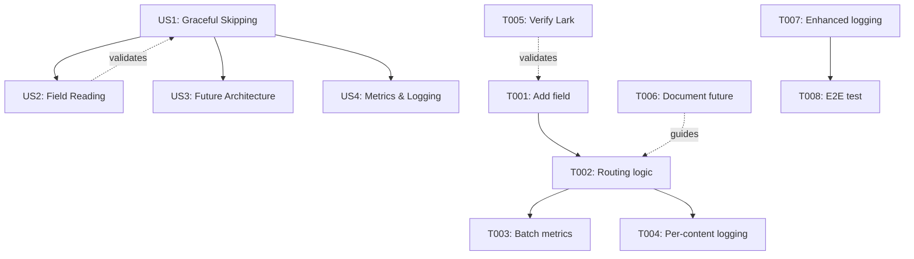

c# Implementation Tasks: Strategy-Aware Analysis Routing

**Feature**: 003-strategy-routing
**Generated**: 2025-10-20
**Total Tasks**: 8
**Estimated Time**: ~1.5 hours

## Task Organization

Tasks are organized by user story priority (P1, P2, P3) to enable independent implementation and testing.

---

## Phase 1: Setup

No setup tasks required - using existing project structure and dependencies.

---

## Phase 2: Foundational Tasks

No foundational tasks - this feature builds directly on existing infrastructure from Features 001 and 002.

---

## Phase 3: User Story 1 (P1) - Graceful Skipping for Non-Competitor Content

**Goal**: Analyze only Competitor Intelligence content and gracefully skip Trend Discovery and Niche Deep-Dive content without errors.

**Independent Test Criteria**:
- Given content with monitoring_strategy="Competitor Intelligence", content is analyzed
- Given content with monitoring_strategy="Trend Discovery", analysis is skipped with informative message
- Given content with monitoring_strategy="Niche Deep-Dive", analysis is skipped with informative message
- Batch of mixed-strategy content produces accurate summary (X analyzed, Y skipped)

### Tasks

**T001** [US1] Add `monitoring_strategy` field to `TikTokContent` dataclass
**File**: `src/core/models.py`
**Details**:
- Add `monitoring_strategy: Optional[str] = None` field after `strategic_insights` field (line 62)
- Update comment to note: "Auto-populated via Lark Base lookup from Target table"
- No database schema changes needed (field already exists in Lark)

**T002** [US1] Implement strategy routing logic in `analyze_content()` method
**File**: `src/analysis/video_analyzer.py`
**Details**:
- Modify `analyze_content()` method (line 46) to read `content.monitoring_strategy`
- Replace `analysis_type` parameter logic with strategy-based routing:
  ```python
  def analyze_content(self, content: TikTokContent) -> Optional[AnalysisResult]:
      if not self.model:
          return None

      strategy = content.monitoring_strategy

      # Route based on monitoring strategy
      if strategy == "Competitor Intelligence":
          return self._analyze_competitor_intelligence(content)
      elif strategy == "Trend Discovery":
          print(f"   ⏭️  {content.content_id} (Trend Discovery) - skipping (prompt not implemented)")
          return None
      elif strategy == "Niche Deep-Dive":
          print(f"   ⏭️  {content.content_id} (Niche Deep-Dive) - skipping (prompt not implemented)")
          return None
      elif strategy is None or strategy == "":
          print(f"   ⚠️  {content.content_id} - No monitoring strategy, skipping analysis")
          return None
      else:
          print(f"   ⚠️  {content.content_id} - Unknown strategy '{strategy}', skipping")
          return None
  ```
- Keep backward compatibility: existing `analysis_type` parameter can be deprecated

**T003** [US1] Update `batch_analyze()` to track strategy metrics
**File**: `src/analysis/video_analyzer.py`
**Details**:
- Modify `batch_analyze()` method (line 213) to track counts by strategy
- Add counters: `analyzed_count`, `skipped_count` by strategy type
- Generate summary report at end:
  ```python
  print(f"📊 Analysis complete:")
  print(f"   ✅ Competitor Intelligence: {competitor_analyzed} analyzed")
  if trend_skipped > 0:
      print(f"   ⏭️  Trend Discovery: {trend_skipped} skipped (awaiting prompt)")
  if niche_skipped > 0:
      print(f"   ⏭️  Niche Deep-Dive: {niche_skipped} skipped (awaiting prompt)")
  ```

**T004** [US1] Add per-content logging to show strategy during analysis
**File**: `src/analysis/video_analyzer.py`
**Details**:
- Update `batch_analyze()` logging (line 218) to include strategy:
  ```python
  strategy_label = content.monitoring_strategy or "Unknown"
  print(f"🤖 Analyzing {content.content_id} ({strategy_label})...")
  ```
- This provides visibility into what's being processed

---

## Phase 4: User Story 2 (P1) - Strategy Field Reading from Lark Base

**Goal**: System reads monitoring_strategy field from Lark Base and uses it for routing decisions.

**Independent Test Criteria**:
- Content retrieved from Lark Base has monitoring_strategy field populated
- TikTokContent object contains correct strategy value from lookup
- Strategy routing uses the Lark-provided value

### Tasks

**T005** [US2] Verify monitoring_strategy field is retrieved from Lark Base
**File**: `src/storage/lark_client.py`
**Details**:
- No code changes needed - monitoring_strategy is auto-populated via Lark lookup
- Document in comment that field flows from: Monitoring Targets → TikTok Content (via lookup)
- Verification only: Check that when content is retrieved, monitoring_strategy field is present

**CHECKPOINT**: Test with real Lark data
- Retrieve content from Lark Base
- Verify `monitoring_strategy` field contains correct value
- Run analysis on mixed-strategy content
- Verify routing works correctly

---

## Phase 5: User Story 3 (P2) - Future-Ready Architecture

**Goal**: System architecture supports easy addition of new strategy-specific prompts.

**Independent Test Criteria**:
- Adding new strategy prompt requires changes to only 2 locations
- New strategy can be added without modifying core routing logic structure

### Tasks

**T006** [US3] Document future prompt routing architecture
**File**: `src/analysis/video_analyzer.py`
**Details**:
- Update module docstring (already exists, lines 1-16) to clarify current implementation
- Add comment block showing future dictionary-based routing:
  ```python
  # Future Enhancement: Dictionary-based routing for cleaner extensibility
  # STRATEGY_METHODS = {
  #     "Competitor Intelligence": self._analyze_competitor_intelligence,
  #     "Trend Discovery": self._analyze_trend_discovery,  # future
  #     "Niche Deep-Dive": self._analyze_niche_deepdive,   # future
  # }
  # method = STRATEGY_METHODS.get(strategy, lambda x: None)
  # return method(content)
  ```
- Document that adding new strategy requires:
  1. Add prompt to `src/analysis/prompts.py`
  2. Add routing case (or dictionary entry) in `analyze_content()`

---

## Phase 6: User Story 4 (P3) - Clear Analysis Metrics and Logging

**Goal**: Provide clear visibility into which content was analyzed vs skipped with strategy-specific metrics.

**Independent Test Criteria**:
- Console output shows strategy for each content item
- Summary shows counts by strategy type
- Skip messages explain why content was skipped

### Tasks

**T007** [US4] Enhance logging with strategy-aware messages
**File**: `src/analysis/video_analyzer.py`
**Details**:
- Already covered in T002-T004
- Ensure all log messages include strategy context
- Verify skip messages are clear and actionable

**T008** [US4] Test end-to-end with mixed-strategy content
**File**: Manual testing / validation
**Details**:
- Create or use existing content with all three strategies:
  - Competitor Intelligence (should analyze)
  - Trend Discovery (should skip)
  - Niche Deep-Dive (should skip)
- Run `batch_analyze()` and verify:
  - Correct routing for each strategy
  - No errors or exceptions
  - Accurate summary metrics
  - Clear logging output
- Document test results

**FINAL CHECKPOINT**: Feature Complete
- All user stories tested independently
- Mixed-strategy content processed correctly
- No backward compatibility breaks
- Ready for production use

---

## Dependencies



**Story Dependencies**:
- US2 validates US1 (field reading enables routing)
- US3, US4 enhance US1 (architecture and logging improvements)
- All stories can be developed in parallel after foundational data model change (T001)

---

## Parallel Execution Opportunities

### Within User Story 1
- T001 (add field) must complete first
- T002, T003, T004 can be developed sequentially (same file)
- T005 can run in parallel (different file)

### Cross-Story Parallelization
- US3 (documentation) can be done in parallel with US1 implementation
- US4 (logging) builds on US1, but can overlap significantly

### Suggested Execution Order
1. **Sprint 1**: T001 → T002 (core routing) → T005 (validate)
2. **Sprint 2**: T003 + T004 (metrics & logging) [P]
3. **Sprint 3**: T006 (documentation) + T007-T008 (validation) [P]

---

## Implementation Strategy

### MVP Scope (User Story 1 only)
**Goal**: Get graceful skipping working for mixed-strategy content
**Tasks**: T001, T002, T005
**Time**: ~45 minutes
**Deliverable**: Competitor Intelligence content analyzed, other strategies skipped gracefully

### Full Feature (All User Stories)
**Goal**: Complete strategy-aware routing with metrics and future-ready architecture
**Tasks**: T001-T008
**Time**: ~1.5 hours
**Deliverable**: Production-ready multi-strategy routing system

### Incremental Delivery
1. **Iteration 1**: MVP (T001-T002, T005) - Core routing works
2. **Iteration 2**: Add metrics (T003-T004) - Visibility into processing
3. **Iteration 3**: Polish (T006-T008) - Documentation and validation

---

## Success Metrics

- ✅ T001-T002 complete → Competitor Intelligence content analyzed
- ✅ T002 complete → Trend/Niche content skipped gracefully (0 errors)
- ✅ T003 complete → Accurate summary metrics by strategy
- ✅ T004 complete → Clear per-content logging
- ✅ T005 complete → monitoring_strategy field working from Lark
- ✅ T006 complete → Future architecture documented
- ✅ T007-T008 complete → End-to-end validation passed

**Acceptance Criteria** (from spec.md):
- Given 10 mixed-strategy items (7 Competitor, 2 Trend, 1 Niche)
- When batch analysis runs
- Then summary shows "7 analyzed, 3 skipped"
- And no errors or exceptions occur
- And all Competitor Intelligence content has AI analysis populated

---

## Notes

- **No new dependencies**: Uses existing Python, Gemini API, Lark Base libraries
- **No database changes**: monitoring_strategy field already exists in Lark via lookup
- **Backward compatible**: Existing code continues to work
- **Future-ready**: Easy to add Trend Discovery and Niche Deep-Dive prompts later
